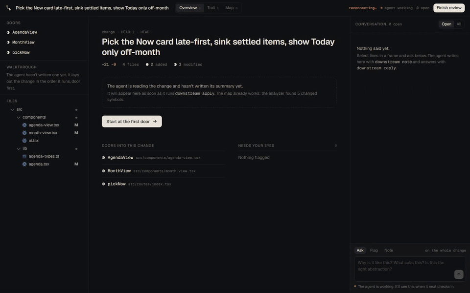
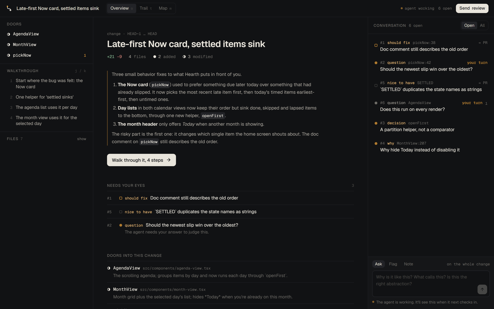
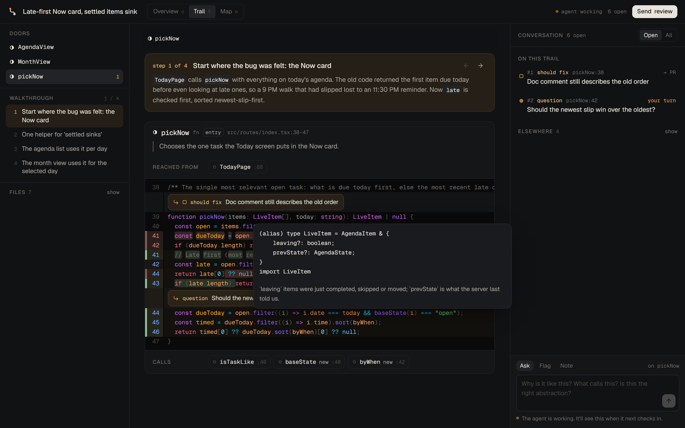
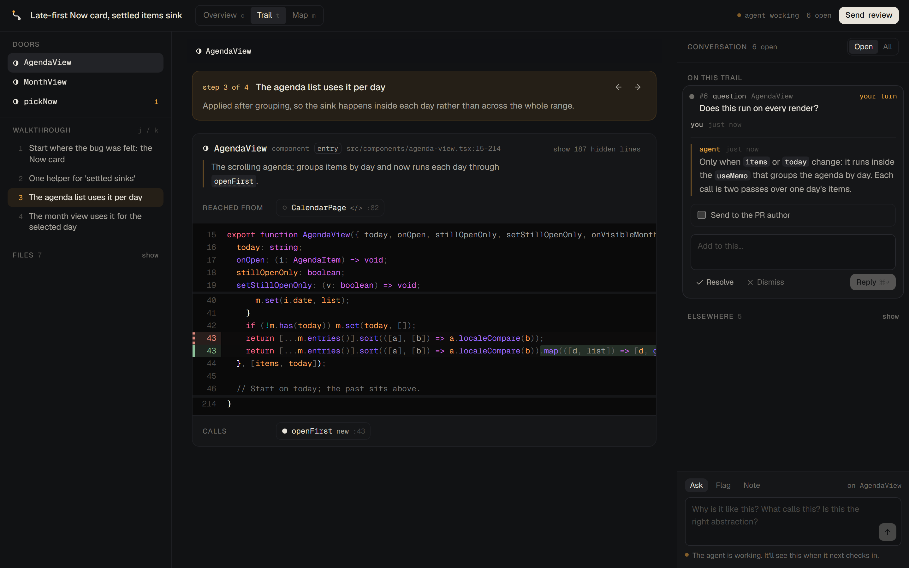
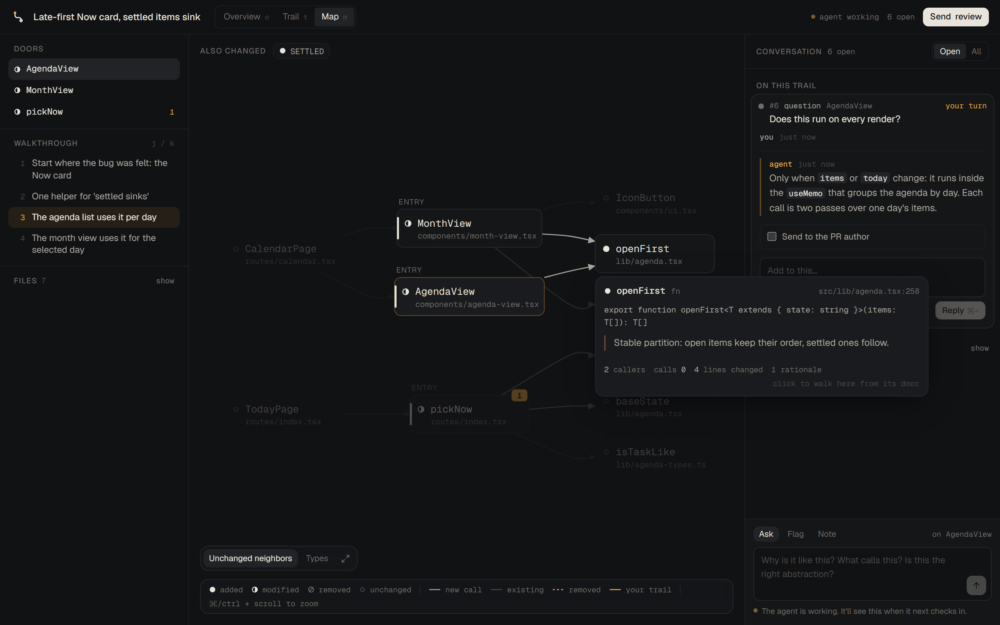
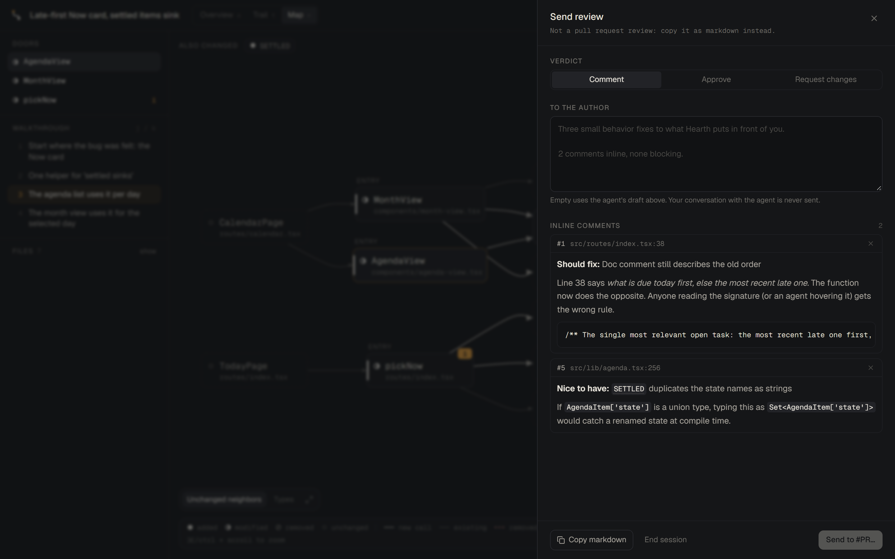

# Downstream

Code review that reads a change the way it runs.

Ask your coding agent to review a pull request, or to explain part of the codebase, and Downstream opens next to it: the change laid out from its entry points, each call one click deeper, the agent's reasons pinned to the lines they're about, and a margin where you talk it through with the agent while it listens. When you agree, the review you arrived at goes to the pull request: your verdict, your words, inline comments the author can apply in one click.



## Why

A diff is a list of files, top to bottom, alphabetically. Nobody understands code that way. You find where control comes in, follow what it calls, and stop wherever something looks odd to ask why it's like that. The diff never tells you the entry point, never shows who calls the function you're reading, and never says why the author chose this interface over the obvious other one. That lives in the author's head, or now in the agent's context, and it's gone when the PR merges.

Downstream gives the change that shape:

- **Doors.** The entry points into the change: the route, the command, the component a page renders. Nothing else in the change calls them, so you start there.
- **Trail.** Open a door and its code appears scoped to just that symbol, numbered like the real file. Click a call and the callee opens below it; the frame above folds to the one line that made the call. You read down the stack the way the code runs.
- **Margin.** The agent writes `why` notes where a careful reader would stop, `decision` notes with the alternatives that lost, and findings with a severity and a failure scenario. You select lines and ask. It answers in the margin while you keep reading.
- **Map.** The whole change as a system, left to right from its doors: what's new, what's changed, which calls are new, and which existing code reaches in.
- **Send.** Findings are numbered (*fix 2 and 5*) and carry the problem, the smallest fix and what happens if you ship anyway. Each thread decides whether it reaches the author and in what words; the conversation stays private. Send review shows the exact review GitHub will get and posts it only when you confirm.

Hover anything in the code for its real TypeScript type and docs. Hover a symbol on the map or in a note for its purpose, callers, calls and open findings.

| | |
|---|---|
|  |  |
|  |  |



## How it works with an agent

Downstream is a [Claude Code skill](SKILL.md). The agent drives a small CLI; you use the browser. Both go through the same actions on the same review, so either side can do anything the other can.

```bash
downstream open --pr 42          # analyze the change, open the browser
downstream show                  # the agent reads the map: doors, symbols, edges
downstream code pickNow          # and the code, numbered, with +/- marks and callers
downstream apply plan.json       # it writes the walkthrough: summary, steps, why, decisions, findings
downstream wait                  # then listens; returns when you ask, reply, resolve or finish
downstream reply 2 "…"           # and answers in the margin
downstream go openFirst          # or moves your view to what it's talking about
downstream outgoing 2 "…"        # words a finding for the author (or --exclude keeps it private)
downstream draft                 # the review exactly as it would be sent; you press Send
```

`downstream open --teach src/sync` does the same for existing code: no diff, a tour of how one request moves through that part of the system.

The analyzer does the mechanical part. It diffs the change against the merge base, finds every function, method, class, type, component and route that changed (JSDoc included), and resolves calls, renders and type uses through the TypeScript compiler. It finds unchanged callers, and works out which calls are new in the change and which disappeared. The agent does the part only a reader can: what each piece is for, the order to read it in, why it's shaped this way, and what's wrong with it.

## Built on agent-first primitives

Downstream follows the [agent-first-apps](https://github.com/armanckeser/agent-first-apps) contract, adapted to a tool that starts in a second inside any repository:

- **One source of truth.** A SQLite database per repository (`.downstream/review.db`, kept out of git). The agent can query it read-only with `downstream sql`, and that connection cannot write.
- **One action surface.** Every change is an action defined once in `server/actions.ts` with a schema: `note.add`, `note.reply`, `steps.set`, `symbol.annotate`, `navigate`, …. The browser, the CLI and plain HTTP all call it. `downstream actions` lists them.
- **Live sync.** Every action emits an event. The browser follows them over server-sent events and updates as the agent writes.
- **Shared application state.** The browser reports what you're looking at (the view, the trail of open frames, your selected lines), so when you ask about "this" the agent already knows what this is (`downstream screen`). The agent can move your view with `navigate`.
- **Presence.** While `downstream wait` is blocked on you, the UI shows the agent as listening.

Postgres and Electric would be the agent-first default. A review is short-lived, local and per repository, though, so an embedded database and SSE keep the same guarantees with nothing to start.

## Install

```bash
git clone https://github.com/armanckeser/downstream ~/.claude/skills/downstream
cd ~/.claude/skills/downstream && npm install && npm run build
```

Then ask Claude Code to review something: *"help me review this branch"*, *"review PR 42 with me"*, *"teach me how the sync engine works"*. The first `open` in a repository takes a few seconds while TypeScript loads the project; after that the hovers are instant.

Requires Node 22.13 or newer and git. `--pr` uses the GitHub CLI.

**Languages.** TypeScript and JavaScript go through the compiler: symbols, call resolution, callers, real types on hover. Python is read from indentation and imports: functions, classes and methods with decorators and docstrings, FastAPI/Flask routes as doors, calls through imports and `self`, callers across the repo, signatures and docstrings on hover. Tests in either are marked as tests. Other languages arrive as one symbol per changed file; the agent splits them into real functions and draws the edges (`addSymbols`, `edges` in `apply`).

## Development

```bash
npm install
npm run build          # the web UI, served by the local server
npm test               # analyzer tests against throwaway git repos
npm run typecheck
DOWNSTREAM_API=http://127.0.0.1:4317 npm run dev:web   # UI with hot reload against a running review
```

| Path | What lives there |
|---|---|
| `SKILL.md` | The agent's instructions: the loop, what a good walkthrough contains, how to talk in the margin |
| `domain/model.ts` | The review model, shared by server, CLI and browser |
| `server/analyze/` | Git sides, TypeScript declarations, the flow graph |
| `server/actions.ts` | Every action, defined once |
| `server/publish.ts` | The review as the PR author sees it, and sending it |
| `server/analyze/py.ts` | Python declarations, imports and calls |
| `server/main.ts` | HTTP, SSE, `wait` |
| `cli/downstream.ts` | The agent's CLI |
| `web/src/` | The review surface (React, Tailwind, [Pierre diffs](https://diffs.com) and [trees](https://www.npmjs.com/package/@pierre/trees), dagre) |
| `scripts/demo.mjs` | Records the demo above against a real repository |

## License

All rights reserved.
